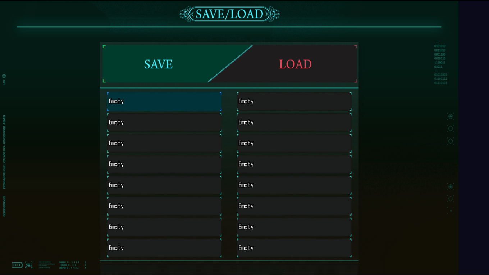

# LOGICPULSE Interactive MZ Save/Load UI

## 👤 Author: LOGICPULSE INTERACTIVE

A fully customisable, modern Save/Load UI for RPG Maker MZ – replaces the default scene with a sleek 18‑slot grid, mouse & keyboard support, and per‑slot metadata.



---

This plugin is open‑source and available under the MIT License.

For support or feature requests, please open an issue on GitHub.

---

## ✨ Features

- **Mouse & Keyboard Support** – Click, hover, scroll, and keyboard shortcuts (Arrow keys, Enter, Escape, Tab).
- **18+ Save Slots** – Configurable grid layout (2 columns × 9 rows). Adjust slot count and spacing via parameters.
- **SAVE / LOAD Tabs** – Switch between modes with a single click or the Tab key; visual feedback on active tab.
- **Rich Metadata** – Stores party leader level and gold at the time of saving – displayed on each slot.
- **Custom Pictures** – Full control over background, tab buttons, and slot boxes.
- **Flexible Layout** – Position slots and text using grid coordinates, offsets, and font settings.
- **Sound Effects** – Customisable cursor, confirm, cancel, and buzzer sounds.
- **Lightweight & Fast** – No database modifications; works with existing save files (metadata stored separately).

---

## 🖼️ Assets

Place all images in **`img/LOGICPULSE_INTERACTIVE UI/Save_Load_UI/`**.  
The plugin expects these files (case‑sensitive):

| File name                     | Description 			  |
|-------------------------------|---------------------------------|
| `Background.png`              | Main shop background		  |
| `Load Tab Idle.png`           | Buy tab (inactive)		  |
| `Load Tab Hover.png`          | Buy tab (active)		  |
| `Save Tab Idle.png`           | Sell tab (inactive) 		  |
| `Save Tab Hover.png`          | Sell tab (active) 		  |
| `Slot Box Idle.png`           | Solt background (inactive)      |
| `Slot Box Hover.png`          | Solt background (active)        |


---

## 🖼️ How To Work With This Plugin

### Changing Slot Appearance

Place your custom images in:
img/LOGICPULSE_INTERACTIVE UI/Save_Load_UI/

### Adjusting Layout & Text

All layout parameters are available in the Plugin Manager:
```text
Grid – column X positions, row Y position, cell size.
Text – font face, size, colour, offsets, vertical positioning.
Sound – custom SE filenames for cursor, OK, cancel, and buzzer.
```
---

## 📦 Installation
1. Download and Place LOGICPULSE_Core plugin above this plugin in Plugin Manager.
2. Download the latest release `.zip` file.
3. Place it in your project’s `Main` folder.
4. In RPG Maker MZ, open the **Plugin Manager** and add the plugin.
5. Ensure the image assets are placed in the correct folder (see **Assets** above).
6. Enable the plugin and save your project.
7.To open the Save/Load scene from an event, use the script call:
`SceneManager.push(LOGICPULSE.Scenes.SaveLoad);`

---

### File Structure

```text
src/
├── Version.js                – Plugin name and version.
├── Constants.js              – Save/Load mode constants.
├── managers/
│   ├── LPAssets.js           – Image loading and parameter caching.
│   ├── LPLayout.js           – Layout coordinates (tabs, grid, text).
│   ├── LPBindings.js         – Key mappings (arrows, Enter, Tab, Escape).
│   ├── LPSaveLoadProvider.js – Global info and metadata management.
│   └── LPSaveLoadController.js – Scene controller (navigation, save/load logic).
├── ui/
│   ├── LPGridSlot.js         – Slot display (idle/hover, two‑line text).
│   └── LPGrid.js             – Grid layout, scrolling, selection.
├── scenes/
│   └── LPSaveLoadScene.js    – Main Save/Load scene (background, tabs, grid).
└── Main.js                   – Plugin entry point (initialises provider).
```
---

### How to Edit

1. Make changes to any `.js` file inside `src/`.
2. Run the **build script** (e.g., `npm run build` or your custom bundler) to generate the final plugin file.
3. Replace the plugin in your RPG Maker project with the newly built `.js` file.

> **Note:** The build process concatenates all `src` files in the order defined in your build configuration. Do not edit the final bundled file directly.

---


## 🔧 Troubleshooting
- **Images not showing?**  
  Check file paths. Images must be in img/LOGICPULSE_INTERACTIVE UI/Save_Load_UI/.
- **Slots not updating after save?**  	
  Close and reopen the Save/Load scene, or wait a moment – it refreshes automatically.
- **“Empty” text is too high/low?**	
  Adjust VerticalOffset in Plugin Manager, or edit emptyY in LPGridSlot.js.


Enjoy!
– LOGICPULSE
